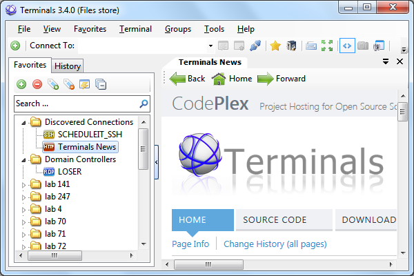
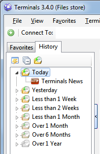
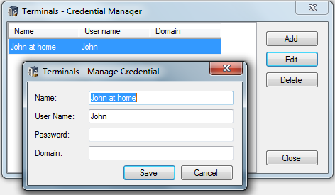
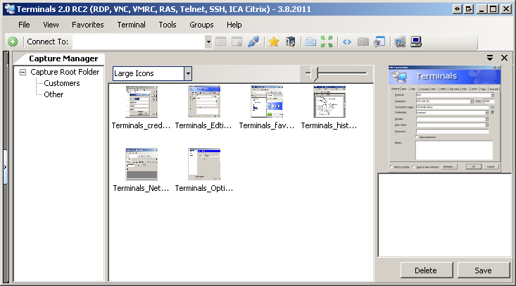

# Features and Screen shots
## User interface
* Multi tab interface 
* Open terminal in full screen, switch between full screen mode 
* Resizable terminal window 
* Attached and dettached Windows 
* Connections history
* Customizable toolbars 
* Open custom application from Terminals window
* Toolbar for computer control panel applets
* Search in ServerName, protocol notes etc.
* 

                 
     
## Connection options 
* Select one of available protocols and custom port 
* Terminal fonts and colors (ssh) 
* Automatically connect with stored credentials 
* Custom connection icon 
* Screen size and screen mode (RDP) 
* Before connection scripts 
* Organize connections by Tags (Groups)
* Organize Groups in Tree like in any other Explorer

  
## Manage favorites
* Import from other file formats 
* Search computers in Active directory 
* Search computers in your network by IP addresses
* Automatic import RDP connection from registry 

## Networking tools
* Ping 
* Tracert 
* DNS tools 
* Wake on lan 
* Port scanner 
* Shares 
* Services 
* Who is? 
* Interfaces 

  
## Credentials manager 
* Store your connections credentials in secured file, so you don't have to retype them when connecting 
* Reuse them for more then one connection 
* Define default connection credentials 

## Capture manager 
* Create screen shots of your terminal sessions 
* Manage and view captured pictures 
* Automated capture for all opened sessions
* Publish your captures gallery on Flicker

 
## Application options 
* Define connections interface behavior 
* Set application master password and other security 
* Define settings files directory 
* Define capture behavior 
* Synchronize your configuration to Amazon S3

  
Other screen shots and a brief list of the feature is also at [weblog.aspnet.net](http://weblogs.asp.net/rchartier/archive/2007/10/02/terminals-v1-6b-release.aspx)